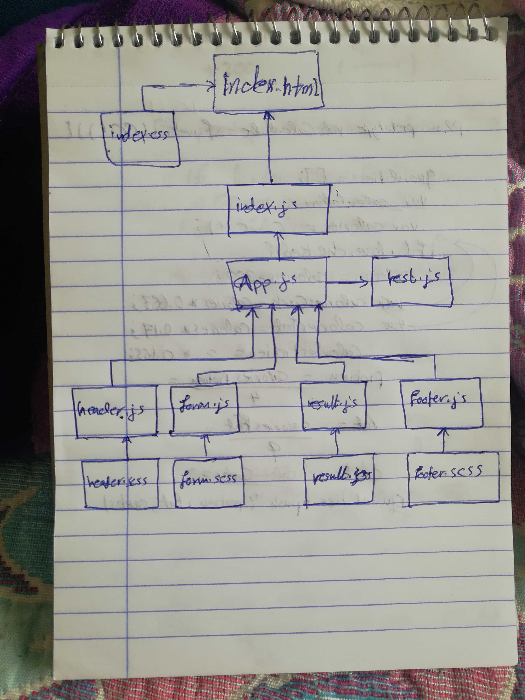

# LAB - Class 28

## Props and State

### Author: Ahmad K. Al-Mahasneh

### Links and Resources

- [submission PR](https://github.com/401-advanced-javascript-AhmadK/props-and-state/pull/2)
- [ci/cd](https://github.com/401-advanced-javascript-AhmadK/props-and-state/actions) (GitHub Actions)
- [gh-pages]()
- [netlify]()

#### How to initialize/run your application (where applicable)

- `npm run build`
- `npm run start`

#### Tests

- How do you run tests?
    `npm run test`
- Any tests of note?
    Snapshot Test
- Describe any tests that you did not complete, skipped, etc
    all passed

#### UML

